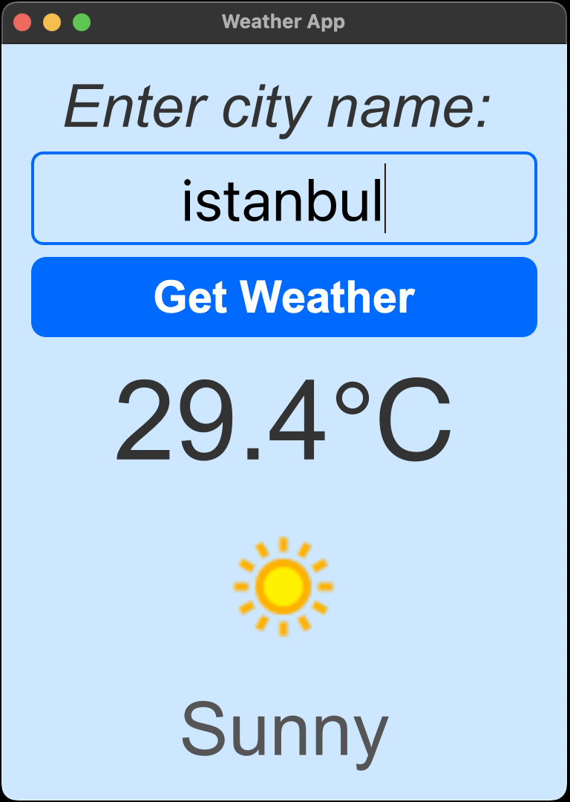
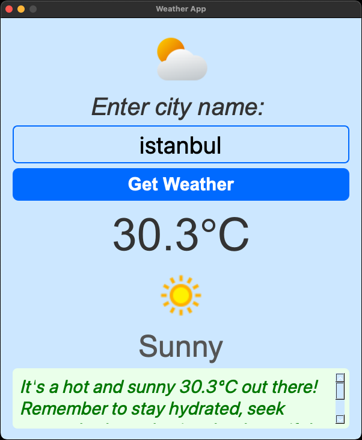

# 🌦️ PyQt5 Weather App (AI Enhanced)


A modern desktop weather application built with **PyQt5**, now upgraded with **Gemini AI** to provide smart, friendly advice based on live weather conditions.  

This version enhances the original app by integrating Google’s Gemini API for a more intelligent and interactive user experience.  

---

## ✨ What's New in v2.x (AI Enhanced)
- 🤖 **AI-Powered Insights**  
  Google Gemini gives short, friendly, context-aware daily advice based on the current weather.  

- 🖼️ **Weather Icon Added**  
  Displays a custom weather icon at the top of the UI.  

- 📜 **Improved UI Layout**  
  Redesigned for better readability and aesthetic appeal.  

- 📦 **Dependencies Updated**  
  - Added `google-generativeai` for AI functionality.
  - Compatible with Python 3.10+.

---

## 📖 About
This project was created as a learning exercise to explore PyQt5 GUI development and API integrations in Python.  
It now showcases how AI (Gemini API) can be integrated into desktop applications to enhance user experience.

It aims to demonstrate:
- 🧼 Clean code practices
- 🔥 API handling (WeatherAPI & Gemini)
- 🖥️ User-friendly PyQt5 desktop applications

---

## ✨ Features

### 🌤️ Standard Weather Features
- 🖥️ Beautiful PyQt5 GUI
- 🌐 Fetches live weather data
- 🌡️ Displays temperature, description, and weather icon
- 🔑 Secure API key management using `.env`
- 📦 Lightweight and easy to run

### 🤖 AI Enhanced Features (New)
- Generates short, context-aware daily advice using Google Gemini API
- Redesigned UI layout for better readability and modern look
- Optional AI integration (works without Gemini if not configured)

---

## 📸 Screenshots

| Main Screen                              | AI Advice Section                      |
|-------------------------------------------|-----------------------------------------|
|     |  |

---

## 🚀 Getting Started

### 1️⃣ Clone the Repository
```bash
git clone https://github.com/OnurCekmez/pyqt5-weather-app.git
cd pyqt5-weather-app
```
---

### 📦 Install Dependencies
Make sure you have Python 3.10+ installed. Then run:
```bash
pip install -r requirements.txt
```
---

## 📜 Requirements.txt
These are the Python packages required to run the app:
```
Python 3.10+
PyQt5==5.15.11
python-dotenv==1.1.1
requests==2.32.4
google-generativeai==0.3.1
```
---

## 🏷️ Versioning
This project uses semantic versioning:

- **v1.x** – Original PyQt5 Weather App (WeatherAPI only)
- **v2.x** – AI Enhanced version (WeatherAPI + Google Gemini)

> _The old README is available at `legacy/README-v1.md`_

---

## 🔑 .env Example
Create a `.env` file in the project root with the following content:
```
WEATHER_API_KEY=your_weatherapi_key_here
GEMINI_API_KEY=your_gemini_api_key_here
```
💡 You can get a free API key from [WeatherAPI](https://www.weatherapi.com/)  
💡 You can get a free API key from [Google AI Studio](https://aistudio.google.com/app/apikey)

---

## ▶️ Run the Application
After setting up your API keys and installing dependencies, launch the application with:
```bash
python weather_app.py
```

---
## 📁 Project Structure
pyqt5-weather-app/
├── assets/
├── legacy/
│   └── README-v1.md
├── weather_app.py
├── requirements.txt
├── README.md
├── env.example
└── LICENSE

---

## 📜 License
This project is licensed under the MIT License. See the LICENSE file for details.

---

## 🙌 Credits
- [PyQt5](https://pypi.org/project/PyQt5/) – GUI framework  
- [WeatherAPI](https://www.weatherapi.com/) – Live weather data provider  
- [Google Gemini API](https://aistudio.google.com/app/apikey) – AI-powered insights